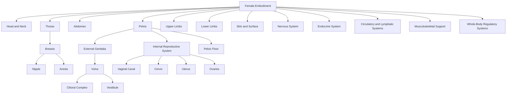

---
tags:
  - Document/Framework
  - Canonical Embodiment/Female
  - Status/Draft
aliases:
  - Female Embodiment Taxonomy
  - Female Anatomical Hierarchy
title: Female Embodiment Framework
file_class: Document
document_type: Framework
layer: Canonical Embodiment
embodiment_scope: Female
status: Draft
version: 0.1
last_updated: 2026-06-29
---

# Female Embodiment Framework

## Purpose

This document defines the top-level anatomical and embodiment hierarchy for the Female embodiment root within the Somatic Meaning Engine.

It is intended for ontology construction, not medical education.

The purpose is to establish a complete embodied taxonomy from which future anatomical nodes, activation pathways, propagation routes, mirrors, expressive layers, and authorial systems can be built.

This document defines canonical structure only. Later layers define response, sensory weighting, symbolic meaning, authorial usage, and corpus annotation.

---

## Design Principles

Female Embodiment is treated as a complete embodiment root.

Genital anatomy is one branch of Female Embodiment, not the root of the hierarchy.

Breast, nipple, pelvic, reproductive, skin, sensory, nervous, endocrine, musculoskeletal, and surface structures may all participate in activation and should therefore be represented in the embodied taxonomy.

### Governing Principles

- Female Embodiment is a root embodiment.
- Structures are modelled within the embodiment root rather than inherited from a shared body register.
- Cross-embodiment similarity can be represented later through explicit relationship edges.
- Composite nodes organize higher-order anatomical regions or systems.
- Atomic nodes represent discrete anatomical structures at the chosen level of modelling.
- Pairedness is a property, not a node type.
- Functional concepts should not be confused with anatomical structures.
- Activation relevance does not determine whether something exists canonically.
- Canonical anatomy defines what exists; later layers define how it responds, propagates, signifies, or appears in authored work.

---

## Node Naming Rule

Embodiment-specific anatomical nodes should use the file naming pattern:

```text
Embodiment - Anatomical Node.md
```

Examples:

```text
Female - Breast.md
Female - Nipple.md
Female - Neck.md
Female - Vulva.md
Female - Pelvic Floor.md
```

This prevents ambiguity across embodiment roots and supports clean Obsidian graph traversal.

YAML may still preserve the clean anatomical name:

```yaml
title: Female - Nipple
canonical_name: Nipple
embodiment_scope: Female
```

---

## Classification Model

### Composite Anatomical Node

A Composite Anatomical Node is a higher-order structure, system, or region that exists because its children collectively form a meaningful anatomical or ontological unit.

Examples:

- Female - Body
- Female - Head and Neck
- Female - Thorax
- Female - Breasts
- Female - Pelvis
- Female - Vulva
- Female - Clitoral Complex
- Female - Vestibule
- Female - Internal Reproductive System
- Female - Pelvic Floor

### Atomic Anatomical Node

An Atomic Anatomical Node is a discrete anatomical structure at the current modelling resolution.

Atomic does not mean biologically indivisible. It means the ontology does not currently need to decompose it further for traversal, activation, or annotation.

Examples:

- Female - Nipple
- Female - Areola
- Female - Labia Majora
- Female - Labia Minora
- Female - Clitoral Glans
- Female - Urethral Opening
- Female - Cervix

### Paired Structure

Paired is a property applied to a node. It should not be used as a node type.

```yaml
paired: true
laterality:
  - Left
  - Right
```

Potential paired structures include:

- Female - Breasts
- Female - Nipples
- Female - Areolae
- Female - Labia Majora
- Female - Labia Minora
- Female - Clitoral Crura
- Female - Vestibular Bulbs
- Female - Ovaries
- Female - Fallopian Tubes

### Distributed Structure

A Distributed Structure is a structure whose functional significance exists across multiple anatomical parts.

Examples:

- Female - Clitoral Complex
- Female - Pelvic Floor
- Female - Mammary Tissue
- Female - Skin
- Female - Nervous System

### Transitional Structure

A Transitional Structure marks an anatomical boundary, opening, or passage between regions or systems.

Examples:

- Female - Vestibule
- Female - Vaginal Opening
- Female - Cervix
- Female - Mouth
- Female - Perineum

---

## Top-Level Taxonomy

```text
Female Embodiment
├── Head and Neck
├── Thorax
├── Abdomen
├── Pelvis
├── Upper Limbs
├── Lower Limbs
├── Skin and Surface
├── Nervous System
├── Endocrine System
├── Circulatory and Lymphatic Systems
├── Musculoskeletal Support
└── Whole-Body Regulatory Systems
```

---

## Primary Embodiment Regions

### Female Embodiment

**Type:** Composite Embodiment Root

**Children:**

- Head and Neck
- Thorax
- Abdomen
- Pelvis
- Upper Limbs
- Lower Limbs
- Skin and Surface
- Nervous System
- Endocrine System
- Circulatory and Lymphatic Systems
- Musculoskeletal Support
- Whole-Body Regulatory Systems

**Ontology Notes:**

- This is the root traversal point for Female embodiment.
- All Female anatomical nodes should ultimately descend from this root.
- Cross-embodiment comparison should be handled through explicit relationships rather than shared node ownership.

---

### Head and Neck

**Type:** Composite Anatomical Region

**Children:** Face, Scalp and Hair, Eyes, Ears, Nose, Mouth, Lips, Tongue, Jaw, Throat, Neck.

**Activation-Relevant Sites:** Lips, Tongue, Mouth, Neck, Ear, Scalp, Jaw, Throat.

---

### Thorax

**Type:** Composite Anatomical Region

**Children:** Chest, Breasts, Sternum, Ribcage, Heart, Lungs, Diaphragm.

**Activation-Relevant Sites:** Breast, Nipple, Areola, Sternum, Chest Wall, Diaphragm.

---

### Abdomen

**Type:** Composite Anatomical Region

**Children:** Upper Abdomen, Lower Abdomen, Navel, Abdominal Wall, Digestive Organs, Core Musculature.

**Activation-Relevant Sites:** Lower Abdomen, Navel, Abdominal Wall, Core Musculature.

---

### Pelvis

**Type:** Composite Anatomical Region

**Children:** External Genitalia, Internal Reproductive System, Pelvic Floor, Perineum, Urinary Structures, Pelvic Bowl, Pelvic Bones.

**Activation-Relevant Sites:** Vulva, Clitoral Complex, Vestibule, Vaginal Opening, Vaginal Canal, Cervix, Pelvic Floor, Perineum, Lower Abdomen.

---

### Upper Limbs

**Type:** Composite Anatomical Region

**Children:** Shoulder, Upper Arm, Elbow, Forearm, Wrist, Hand, Palm, Fingers, Fingertips.

**Activation-Relevant Sites:** Hands, Palms, Fingers, Fingertips, Wrists, Inner Arms, Shoulders.

---

### Lower Limbs

**Type:** Composite Anatomical Region

**Children:** Hip, Thigh, Inner Thigh, Knee, Calf, Ankle, Foot, Sole, Toes.

**Activation-Relevant Sites:** Hips, Inner Thighs, Knees, Calves, Feet, Soles, Toes.

---

### Skin and Surface

**Type:** Distributed Composite Anatomical System

**Children:** Skin, Hair, Body Hair, Scar Tissue, Mucous Membranes, Surface Nerve Endings.

---

### Nervous System

**Type:** Distributed Composite Anatomical System

**Children:** Brain, Spinal Cord, Autonomic Nervous System, Peripheral Nerves, Pudendal Nerve, Pelvic Nerves, Intercostal Nerves, Cutaneous Nerves.

---

### Endocrine System

**Type:** Distributed Composite Anatomical System

**Children:** Ovaries, Pituitary Gland, Hypothalamus, Thyroid, Adrenal Glands, Hormonal Cycles.

**Ontology Note:** Hormonal Cycles may require process-node handling rather than anatomical-node handling.

---

### Circulatory and Lymphatic Systems

**Type:** Distributed Composite Anatomical System

**Children:** Blood Vessels, Capillaries, Lymph Nodes, Lymphatic Vessels, Breast Lymphatics, Pelvic Vasculature.

---

### Musculoskeletal Support

**Type:** Distributed Composite Anatomical System

**Children:** Spine, Pelvic Bones, Ribcage, Shoulder Girdle, Hip Complex, Pelvic Floor Muscles, Fascia, Core Muscles.

---

### Whole-Body Regulatory Systems

**Type:** Composite Functional-Anatomical System

**Children:** Breath, Heart Rate, Temperature Regulation, Muscle Tone, Fatigue, Pain Response, Stress Response.

**Ontology Note:** This branch requires review before node creation. Some entries may belong in Activation and Translation rather than Canonical Embodiment.

---

## Pelvic Branch Detail

```text
Pelvis
├── External Genitalia
│   └── Vulva
│       ├── Mons Pubis
│       ├── Labia Majora
│       ├── Labia Minora
│       ├── Clitoral Complex
│       │   ├── Clitoral Glans
│       │   ├── Clitoral Hood
│       │   ├── Clitoral Body
│       │   ├── Clitoral Crura
│       │   └── Vestibular Bulbs
│       ├── Vestibule
│       │   ├── Urethral Opening
│       │   ├── Vaginal Opening
│       │   └── Vestibular Gland Openings
│       └── Perineal Boundary
├── Internal Reproductive System
│   ├── Vaginal Canal
│   │   ├── Anterior Vaginal Wall
│   │   ├── Posterior Vaginal Wall
│   │   ├── Vaginal Fornix
│   │   └── Vaginal Mucosa
│   ├── Cervix
│   ├── Uterus
│   ├── Fallopian Tubes
│   └── Ovaries
├── Pelvic Floor
├── Perineum
├── Urinary Structures
├── Pelvic Bowl
└── Pelvic Bones
```

---

## Thoracic Branch Detail

```text
Thorax
├── Chest
├── Breasts
│   ├── Left Breast
│   ├── Right Breast
│   ├── Nipple
│   ├── Areola
│   ├── Mammary Tissue
│   ├── Breast Skin
│   ├── Breast Fat Pad
│   ├── Breast Fascia
│   └── Breast Lymphatics
├── Sternum
├── Ribcage
├── Heart
├── Lungs
└── Diaphragm
```

---

## Candidate Node Register

| Node | Parent | Likely Classification | Status |
|---|---|---|---|
| [[Female - Head and Neck]] | [[Female Embodiment]] | Composite Region | Draft |
| [[Female - Thorax]] | [[Female Embodiment]] | Composite Region | Draft |
| [[Female - Abdomen]] | [[Female Embodiment]] | Composite Region | Draft |
| [[Female - Pelvis]] | [[Female Embodiment]] | Composite Region | Draft |
| [[Female - Breast]] | [[Female - Thorax]] | Composite Node | Review |
| [[Female - Nipple]] | [[Female - Breast]] | Atomic Node | Review |
| [[Female - Areola]] | [[Female - Breast]] | Atomic Node | Review |
| [[Female - Vulva]] | [[Female - Pelvis]] | Composite Node | Review |
| [[Female - Clitoral Complex]] | [[Female - Vulva]] | Composite Node | Review |
| [[Female - Vestibule]] | [[Female - Vulva]] | Composite Node | Review |
| [[Female - Vaginal Canal]] | [[Female - Internal Reproductive System]] | Composite Node | Review |
| [[Female - Cervix]] | [[Female - Internal Reproductive System]] | Atomic Node | Review |
| [[Female - Uterus]] | [[Female - Internal Reproductive System]] | Composite Node | Review |
| [[Female - Ovaries]] | [[Female - Internal Reproductive System]] | Paired Atomic or Composite | Review |
| [[Female - Pelvic Floor]] | [[Female - Pelvis]] | Composite Node | Review |
| [[Female - Skin]] | [[Female - Skin and Surface]] | Distributed Composite | Review |
| [[Female - Breath]] | [[Female - Whole-Body Regulatory Systems]] | Process Candidate | Review |
| [[Female - Hormonal Cycles]] | [[Female - Endocrine System]] | Process Candidate | Review |

---

## Mermaid Overview



---

## Review Questions

1. Should Whole-Body Regulatory Systems remain in Canonical Embodiment or move to Activation and Translation?
2. Should Breath be a process node rather than an anatomical node?
3. Should Hormonal Cycles be handled as a process node?
4. Should Scar Tissue be canonical, modifier, event-derived, or sensory-layer dependent?
5. Which candidate nodes become the first Anatomical Node Template validation set?

---

## Related Governance

- [[Architecture]]
- [[Repository Meta Ontology]]
- [[Node Specification]]
- [[Relationship Specification]]
- [[Metadata Standard]]
- [[YAML Standard]]
- [[Repository Lifecycle Standard]]
