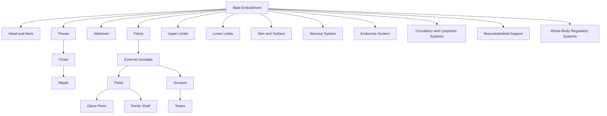

---
tags:
  - Document/Framework
  - Canonical Embodiment/Male
  - Status/Draft
aliases:
  - Male Embodiment Taxonomy
  - Male Anatomical Hierarchy
title: Male Embodiment Framework
file_class: Document
document_type: Framework
layer: Canonical Embodiment
embodiment_scope: Male
status: Draft
version: 0.1
last_updated: 2026-06-29
---

# Male Embodiment Framework

## Purpose

This document defines the top-level anatomical and embodiment hierarchy for the Male embodiment root within the Somatic Meaning Engine.

It establishes a complete embodied taxonomy from which future anatomical nodes, activation pathways, propagation routes, mirrors, expressive layers, and authorial systems can be built.

This document defines canonical structure only.

---

## Design Principles

Male Embodiment is treated as a complete embodiment root.

Structures are modelled within the embodiment root rather than inherited from a shared body register.

Male genital anatomy is one branch of Male Embodiment, not the root of the hierarchy.

Chest, nipple, pelvic, reproductive, urinary, skin, sensory, nervous, endocrine, musculoskeletal, and surface structures may all participate in activation and should therefore be represented in the embodied taxonomy.

---

## Node Naming Rule

Embodiment-specific anatomical nodes should use the file naming pattern:

```text
Embodiment - Anatomical Node.md
```

Examples:

```text
Male - Chest.md
Male - Nipple.md
Male - Neck.md
Male - Penis.md
Male - Pelvic Floor.md
```

YAML may still preserve the clean anatomical name:

```yaml
title: Male - Nipple
canonical_name: Nipple
embodiment_scope: Male
```

---

## Top-Level Taxonomy

```text
Male Embodiment
├── Head and Neck
├── Thorax
├── Abdomen
├── Pelvis
├── Upper Limbs
├── Lower Limbs
├── Skin and Surface
├── Nervous System
├── Endocrine System
├── Circulatory and Lymphatic Systems
├── Musculoskeletal Support
└── Whole-Body Regulatory Systems
```

---

## Primary Embodiment Regions

### Male Embodiment

**Type:** Composite Embodiment Root

**Children:** Head and Neck, Thorax, Abdomen, Pelvis, Upper Limbs, Lower Limbs, Skin and Surface, Nervous System, Endocrine System, Circulatory and Lymphatic Systems, Musculoskeletal Support, Whole-Body Regulatory Systems.

---

### Head and Neck

**Type:** Composite Anatomical Region

**Children:** Face, Scalp and Hair, Eyes, Ears, Nose, Mouth, Lips, Tongue, Jaw, Throat, Neck.

---

### Thorax

**Type:** Composite Anatomical Region

**Children:** Chest, Pectoral Region, Nipple, Areola, Sternum, Ribcage, Heart, Lungs, Diaphragm.

**Ontology Notes:** Male nipple and areola structures should be represented separately from Female, Trans Feminine, and Trans Masculine counterparts where downstream activation or sensory weighting differs.

---

### Abdomen

**Type:** Composite Anatomical Region

**Children:** Upper Abdomen, Lower Abdomen, Navel, Abdominal Wall, Digestive Organs, Core Musculature.

---

### Pelvis

**Type:** Composite Anatomical Region

**Children:** External Genitalia, Internal Reproductive System, Pelvic Floor, Perineum, Urinary Structures, Pelvic Bowl, Pelvic Bones.

---

### Upper Limbs

**Type:** Composite Anatomical Region

**Children:** Shoulder, Upper Arm, Elbow, Forearm, Wrist, Hand, Palm, Fingers, Fingertips.

---

### Lower Limbs

**Type:** Composite Anatomical Region

**Children:** Hip, Thigh, Inner Thigh, Knee, Calf, Ankle, Foot, Sole, Toes.

---

### Skin and Surface

**Type:** Distributed Composite Anatomical System

**Children:** Skin, Hair, Body Hair, Scar Tissue, Mucous Membranes, Surface Nerve Endings.

---

### Nervous System

**Type:** Distributed Composite Anatomical System

**Children:** Brain, Spinal Cord, Autonomic Nervous System, Peripheral Nerves, Pudendal Nerve, Pelvic Nerves, Intercostal Nerves, Cutaneous Nerves.

---

### Endocrine System

**Type:** Distributed Composite Anatomical System

**Children:** Testes, Pituitary Gland, Hypothalamus, Thyroid, Adrenal Glands, Hormonal Regulation.

---

### Circulatory and Lymphatic Systems

**Type:** Distributed Composite Anatomical System

**Children:** Blood Vessels, Capillaries, Lymph Nodes, Lymphatic Vessels, Chest Lymphatics, Pelvic Vasculature.

---

### Musculoskeletal Support

**Type:** Distributed Composite Anatomical System

**Children:** Spine, Pelvic Bones, Ribcage, Shoulder Girdle, Hip Complex, Pelvic Floor Muscles, Fascia, Core Muscles.

---

### Whole-Body Regulatory Systems

**Type:** Composite Functional-Anatomical System

**Children:** Breath, Heart Rate, Temperature Regulation, Muscle Tone, Fatigue, Pain Response, Stress Response.

**Ontology Note:** This branch requires review before node creation. Some entries may belong in Activation and Translation rather than Canonical Embodiment.

---

## Pelvic Branch Detail

```text
Pelvis
├── External Genitalia
│   ├── Penis
│   │   ├── Glans Penis
│   │   ├── Penile Shaft
│   │   ├── Foreskin
│   │   ├── Frenulum
│   │   ├── Corpus Cavernosum
│   │   └── Corpus Spongiosum
│   └── Scrotum
│       ├── Scrotal Skin
│       └── Testes
├── Internal Reproductive System
│   ├── Prostate
│   ├── Seminal Vesicles
│   ├── Vas Deferens
│   └── Ejaculatory Ducts
├── Pelvic Floor
├── Perineum
├── Urinary Structures
│   ├── Urethra
│   ├── Urethral Opening
│   └── Bladder
├── Pelvic Bowl
└── Pelvic Bones
```

---

## Candidate Node Register

| Node | Parent | Likely Classification | Status |
|---|---|---|---|
| [[Male - Head and Neck]] | [[Male Embodiment]] | Composite Region | Draft |
| [[Male - Thorax]] | [[Male Embodiment]] | Composite Region | Draft |
| [[Male - Abdomen]] | [[Male Embodiment]] | Composite Region | Draft |
| [[Male - Pelvis]] | [[Male Embodiment]] | Composite Region | Draft |
| [[Male - Chest]] | [[Male - Thorax]] | Composite Region | Review |
| [[Male - Nipple]] | [[Male - Chest]] | Atomic Node | Review |
| [[Male - Areola]] | [[Male - Chest]] | Atomic Node | Review |
| [[Male - Penis]] | [[Male - Pelvis]] | Composite Node | Review |
| [[Male - Glans Penis]] | [[Male - Penis]] | Atomic Node | Review |
| [[Male - Penile Shaft]] | [[Male - Penis]] | Composite Node | Review |
| [[Male - Scrotum]] | [[Male - Pelvis]] | Composite Node | Review |
| [[Male - Testes]] | [[Male - Scrotum]] | Paired Atomic or Composite | Review |
| [[Male - Prostate]] | [[Male - Internal Reproductive System]] | Atomic or Composite | Review |
| [[Male - Pelvic Floor]] | [[Male - Pelvis]] | Composite Node | Review |
| [[Male - Skin]] | [[Male - Skin and Surface]] | Distributed Composite | Review |
| [[Male - Breath]] | [[Male - Whole-Body Regulatory Systems]] | Process Candidate | Review |

---

## Mermaid Overview



---

## Review Questions

1. Which structures should be decomposed immediately versus left as atomic at v1?
2. Should Breath and Hormonal Regulation be process nodes rather than canonical anatomical nodes?
3. Which Male candidate nodes should be included in the first anatomical template validation set?

---

## Related Governance

- [[Architecture]]
- [[Repository Meta Ontology]]
- [[Node Specification]]
- [[Relationship Specification]]
- [[Metadata Standard]]
- [[YAML Standard]]
- [[Repository Lifecycle Standard]]
