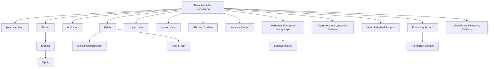

---
tags:
  - Document/Framework
  - Canonical Embodiment/Trans Feminine
  - Status/Draft
aliases:
  - Trans Feminine Embodiment Taxonomy
  - Trans Feminine Anatomical Hierarchy
title: Trans Feminine Embodiment Framework
file_class: Document
document_type: Framework
layer: Canonical Embodiment
embodiment_scope: Trans Feminine
status: Draft
version: 0.1
last_updated: 2026-06-29
---

# Trans Feminine Embodiment Framework

## Purpose

This document defines the top-level anatomical and embodiment hierarchy for the Trans Feminine embodiment root within the Somatic Meaning Engine.

It establishes a complete embodied taxonomy from which future anatomical nodes, activation pathways, propagation routes, mirrors, expressive layers, and authorial systems can be built.

This document defines canonical structure only.

---

## Design Principles

Trans Feminine Embodiment is treated as a complete embodiment root.

Structures are modelled within the embodiment root rather than inherited from a shared body register.

Trans Feminine anatomy should not be treated as a variation note inside Female or Male embodiment. It requires its own traversal root because hormonal, surgical, sensory, scar, symbolic, and authorial relationships may differ.

This framework must remain flexible enough to support varied histories without forcing a single body configuration.

---

## Node Naming Rule

Embodiment-specific anatomical nodes should use the file naming pattern:

```text
Embodiment - Anatomical Node.md
```

Examples:

```text
Trans Feminine - Breast.md
Trans Feminine - Nipple.md
Trans Feminine - Neck.md
Trans Feminine - Pelvic Floor.md
Trans Feminine - Genital Configuration.md
```

YAML may still preserve the clean anatomical name:

```yaml
title: Trans Feminine - Nipple
canonical_name: Nipple
embodiment_scope: Trans Feminine
```

---

## Top-Level Taxonomy

```text
Trans Feminine Embodiment
├── Head and Neck
├── Thorax
├── Abdomen
├── Pelvis
├── Upper Limbs
├── Lower Limbs
├── Skin and Surface
├── Nervous System
├── Endocrine System
├── Circulatory and Lymphatic Systems
├── Musculoskeletal Support
├── Medical and Surgical History Layer
└── Whole-Body Regulatory Systems
```

---

## Primary Embodiment Regions

### Trans Feminine Embodiment

**Type:** Composite Embodiment Root

**Children:** Head and Neck, Thorax, Abdomen, Pelvis, Upper Limbs, Lower Limbs, Skin and Surface, Nervous System, Endocrine System, Circulatory and Lymphatic Systems, Musculoskeletal Support, Medical and Surgical History Layer, Whole-Body Regulatory Systems.

---

### Head and Neck

**Type:** Composite Anatomical Region

**Children:** Face, Scalp and Hair, Eyes, Ears, Nose, Mouth, Lips, Tongue, Jaw, Throat, Neck, Voice Structures.

**Ontology Notes:** Voice Structures may connect later to Sonic and Authorial Systems. Canonical structures should remain separate from voice presentation or authorial register.

---

### Thorax

**Type:** Composite Anatomical Region

**Children:** Chest, Breasts, Nipple, Areola, Breast Tissue, Breast Skin, Breast Fat Distribution, Sternum, Ribcage, Heart, Lungs, Diaphragm.

**Ontology Notes:** Trans Feminine breast and nipple structures should be represented separately because hormonal development, surgery, sensation, scarring, and symbolic relationships may differ across bodies.

---

### Abdomen

**Type:** Composite Anatomical Region

**Children:** Upper Abdomen, Lower Abdomen, Navel, Abdominal Wall, Digestive Organs, Core Musculature, Surgical Scar Candidates.

---

### Pelvis

**Type:** Composite Anatomical Region

**Children:** Genital Configuration, Pelvic Floor, Perineum, Urinary Structures, Pelvic Bowl, Pelvic Bones, Reproductive Residual or Surgical Structures.

**Ontology Notes:** Trans Feminine pelvic anatomy must support multiple configurations. Specific anatomical nodes should be instantiated according to canonical body history rather than forced into one default pattern.

---

### Upper Limbs

**Type:** Composite Anatomical Region

**Children:** Shoulder, Upper Arm, Elbow, Forearm, Wrist, Hand, Palm, Fingers, Fingertips.

---

### Lower Limbs

**Type:** Composite Anatomical Region

**Children:** Hip, Thigh, Inner Thigh, Knee, Calf, Ankle, Foot, Sole, Toes.

---

### Skin and Surface

**Type:** Distributed Composite Anatomical System

**Children:** Skin, Hair, Body Hair, Scar Tissue, Mucous Membranes, Surface Nerve Endings, Hormone-Influenced Skin Texture.

---

### Nervous System

**Type:** Distributed Composite Anatomical System

**Children:** Brain, Spinal Cord, Autonomic Nervous System, Peripheral Nerves, Pudendal Nerve, Pelvic Nerves, Intercostal Nerves, Cutaneous Nerves.

---

### Endocrine System

**Type:** Distributed Composite Anatomical System

**Children:** Pituitary Gland, Hypothalamus, Thyroid, Adrenal Glands, Hormonal Regimen, Hormone-Responsive Tissue.

**Ontology Note:** Hormonal Regimen may require process or medical-history handling rather than a pure anatomical node.

---

### Medical and Surgical History Layer

**Type:** Contextual Canonical Modifier Layer

**Children:** Surgical Scars, Breast Augmentation Status, Genital Surgery Status, Orchiectomy Status, Hormonal Treatment History.

**Ontology Note:** This layer should be reviewed carefully. It may not be an anatomical branch in the strict sense, but it is necessary for accurate embodiment-specific modelling.

---

### Whole-Body Regulatory Systems

**Type:** Composite Functional-Anatomical System

**Children:** Breath, Heart Rate, Temperature Regulation, Muscle Tone, Fatigue, Pain Response, Stress Response.

**Ontology Note:** This branch requires review before node creation. Some entries may belong in Activation and Translation rather than Canonical Embodiment.

---

## Pelvic Branch Detail

```text
Pelvis
├── Genital Configuration
│   ├── External Genital Structures
│   ├── Post-Surgical Genital Structures
│   ├── Neo-Vaginal Canal Candidate
│   ├── Glans or Sensory Tissue Candidate
│   ├── Scrotal Tissue History Candidate
│   └── Perineal Boundary
├── Pelvic Floor
├── Perineum
├── Urinary Structures
│   ├── Urethra
│   ├── Urethral Opening
│   └── Bladder
├── Pelvic Bowl
├── Pelvic Bones
└── Reproductive Residual or Surgical Structures
```

---

## Thoracic Branch Detail

```text
Thorax
├── Chest
├── Breasts
│   ├── Left Breast
│   ├── Right Breast
│   ├── Nipple
│   ├── Areola
│   ├── Breast Tissue
│   ├── Breast Skin
│   ├── Breast Fat Distribution
│   ├── Breast Fascia
│   └── Breast Lymphatics
├── Sternum
├── Ribcage
├── Heart
├── Lungs
└── Diaphragm
```

---

## Candidate Node Register

| Node | Parent | Likely Classification | Status |
|---|---|---|---|
| [[Trans Feminine - Head and Neck]] | [[Trans Feminine Embodiment]] | Composite Region | Draft |
| [[Trans Feminine - Thorax]] | [[Trans Feminine Embodiment]] | Composite Region | Draft |
| [[Trans Feminine - Abdomen]] | [[Trans Feminine Embodiment]] | Composite Region | Draft |
| [[Trans Feminine - Pelvis]] | [[Trans Feminine Embodiment]] | Composite Region | Draft |
| [[Trans Feminine - Breast]] | [[Trans Feminine - Thorax]] | Composite Node | Review |
| [[Trans Feminine - Nipple]] | [[Trans Feminine - Breast]] | Atomic Node | Review |
| [[Trans Feminine - Areola]] | [[Trans Feminine - Breast]] | Atomic Node | Review |
| [[Trans Feminine - Genital Configuration]] | [[Trans Feminine - Pelvis]] | Composite or Contextual Node | Review |
| [[Trans Feminine - Pelvic Floor]] | [[Trans Feminine - Pelvis]] | Composite Node | Review |
| [[Trans Feminine - Skin]] | [[Trans Feminine - Skin and Surface]] | Distributed Composite | Review |
| [[Trans Feminine - Scar Tissue]] | [[Trans Feminine - Skin and Surface]] | Modifier or Node | Review |
| [[Trans Feminine - Hormonal Regimen]] | [[Trans Feminine - Endocrine System]] | Process or Context Node | Review |
| [[Trans Feminine - Surgical History]] | [[Trans Feminine - Medical and Surgical History Layer]] | Context Node | Review |
| [[Trans Feminine - Breath]] | [[Trans Feminine - Whole-Body Regulatory Systems]] | Process Candidate | Review |

---

## Mermaid Overview



---

## Review Questions

1. Which structures are canonical anatomy versus medical-history modifiers?
2. How should varied genital configurations be represented without forcing a single default?
3. Should Hormonal Regimen be a process, context node, or medical-history node?
4. Which Trans Feminine candidate nodes should be included in the first anatomical template validation set?

---

## Related Governance

- [[Architecture]]
- [[Repository Meta Ontology]]
- [[Node Specification]]
- [[Relationship Specification]]
- [[Metadata Standard]]
- [[YAML Standard]]
- [[Repository Lifecycle Standard]]
