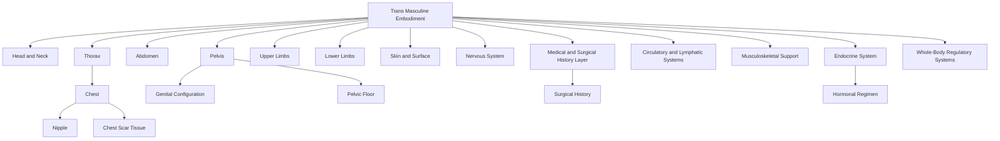

---
tags:
  - Document/Framework
  - Canonical Embodiment/Trans Masculine
  - Status/Draft
aliases:
  - Trans Masculine Embodiment Taxonomy
  - Trans Masculine Anatomical Hierarchy
title: Trans Masculine Embodiment Framework
file_class: Document
document_type: Framework
layer: Canonical Embodiment
embodiment_scope: Trans Masculine
status: Draft
version: 0.1
last_updated: 2026-06-29
---

# Trans Masculine Embodiment Framework

## Purpose

This document defines the top-level anatomical and embodiment hierarchy for the Trans Masculine embodiment root within the Somatic Meaning Engine.

It establishes a complete embodied taxonomy from which future anatomical nodes, activation pathways, propagation routes, mirrors, expressive layers, and authorial systems can be built.

This document defines canonical structure only.

---

## Design Principles

Trans Masculine Embodiment is treated as a complete embodiment root.

Structures are modelled within the embodiment root rather than inherited from a shared body register.

Trans Masculine anatomy should not be treated as a variation note inside Female or Male embodiment. It requires its own traversal root because hormonal, surgical, sensory, scar, symbolic, and authorial relationships may differ.

This framework must remain flexible enough to support varied histories without forcing a single body configuration.

---

## Node Naming Rule

Embodiment-specific anatomical nodes should use the file naming pattern:

```text
Embodiment - Anatomical Node.md
```

Examples:

```text
Trans Masculine - Chest.md
Trans Masculine - Nipple.md
Trans Masculine - Neck.md
Trans Masculine - Pelvic Floor.md
Trans Masculine - Genital Configuration.md
```

YAML may still preserve the clean anatomical name:

```yaml
title: Trans Masculine - Nipple
canonical_name: Nipple
embodiment_scope: Trans Masculine
```

---

## Top-Level Taxonomy

```text
Trans Masculine Embodiment
├── Head and Neck
├── Thorax
├── Abdomen
├── Pelvis
├── Upper Limbs
├── Lower Limbs
├── Skin and Surface
├── Nervous System
├── Endocrine System
├── Circulatory and Lymphatic Systems
├── Musculoskeletal Support
├── Medical and Surgical History Layer
└── Whole-Body Regulatory Systems
```

---

## Primary Embodiment Regions

### Trans Masculine Embodiment

**Type:** Composite Embodiment Root

**Children:** Head and Neck, Thorax, Abdomen, Pelvis, Upper Limbs, Lower Limbs, Skin and Surface, Nervous System, Endocrine System, Circulatory and Lymphatic Systems, Musculoskeletal Support, Medical and Surgical History Layer, Whole-Body Regulatory Systems.

---

### Head and Neck

**Type:** Composite Anatomical Region

**Children:** Face, Scalp and Hair, Eyes, Ears, Nose, Mouth, Lips, Tongue, Jaw, Throat, Neck, Voice Structures, Facial Hair Candidates.

**Ontology Notes:** Voice and hair-related structures may connect later to Sonic, Surface, Hormonal, and Authorial systems.

---

### Thorax

**Type:** Composite Anatomical Region

**Children:** Chest, Chest Wall, Nipple, Areola, Breast Tissue History, Surgical Chest Configuration, Scar Tissue, Sternum, Ribcage, Heart, Lungs, Diaphragm.

**Ontology Notes:** Trans Masculine chest, nipple, areola, scar, and surgical configuration structures should be represented separately because surgical history, sensation, scarring, symbolic meaning, and authorial relationships may differ across bodies.

---

### Abdomen

**Type:** Composite Anatomical Region

**Children:** Upper Abdomen, Lower Abdomen, Navel, Abdominal Wall, Digestive Organs, Core Musculature, Surgical Scar Candidates.

---

### Pelvis

**Type:** Composite Anatomical Region

**Children:** Genital Configuration, Internal Reproductive System Candidate, Pelvic Floor, Perineum, Urinary Structures, Pelvic Bowl, Pelvic Bones, Reproductive Organ Status.

**Ontology Notes:** Trans Masculine pelvic anatomy must support multiple configurations. Specific anatomical nodes should be instantiated according to canonical body history rather than forced into one default pattern.

---

### Upper Limbs

**Type:** Composite Anatomical Region

**Children:** Shoulder, Upper Arm, Elbow, Forearm, Wrist, Hand, Palm, Fingers, Fingertips.

---

### Lower Limbs

**Type:** Composite Anatomical Region

**Children:** Hip, Thigh, Inner Thigh, Knee, Calf, Ankle, Foot, Sole, Toes.

---

### Skin and Surface

**Type:** Distributed Composite Anatomical System

**Children:** Skin, Hair, Body Hair, Facial Hair, Scar Tissue, Mucous Membranes, Surface Nerve Endings, Hormone-Influenced Skin Texture.

---

### Nervous System

**Type:** Distributed Composite Anatomical System

**Children:** Brain, Spinal Cord, Autonomic Nervous System, Peripheral Nerves, Pudendal Nerve, Pelvic Nerves, Intercostal Nerves, Cutaneous Nerves.

---

### Endocrine System

**Type:** Distributed Composite Anatomical System

**Children:** Pituitary Gland, Hypothalamus, Thyroid, Adrenal Glands, Hormonal Regimen, Hormone-Responsive Tissue, Ovarian Status Candidate.

**Ontology Note:** Hormonal Regimen and organ status may require process or medical-history handling rather than pure anatomical-node handling.

---

### Medical and Surgical History Layer

**Type:** Contextual Canonical Modifier Layer

**Children:** Surgical Scars, Chest Surgery Status, Genital Surgery Status, Hysterectomy Status, Oophorectomy Status, Hormonal Treatment History.

**Ontology Note:** This layer should be reviewed carefully. It may not be an anatomical branch in the strict sense, but it is necessary for accurate embodiment-specific modelling.

---

### Whole-Body Regulatory Systems

**Type:** Composite Functional-Anatomical System

**Children:** Breath, Heart Rate, Temperature Regulation, Muscle Tone, Fatigue, Pain Response, Stress Response.

**Ontology Note:** This branch requires review before node creation. Some entries may belong in Activation and Translation rather than Canonical Embodiment.

---

## Thoracic Branch Detail

```text
Thorax
├── Chest
│   ├── Chest Wall
│   ├── Nipple
│   ├── Areola
│   ├── Breast Tissue History
│   ├── Surgical Chest Configuration
│   ├── Chest Scar Tissue
│   └── Chest Fascia
├── Sternum
├── Ribcage
├── Heart
├── Lungs
└── Diaphragm
```

---

## Pelvic Branch Detail

```text
Pelvis
├── Genital Configuration
│   ├── External Genital Structures
│   ├── Hormone-Influenced Genital Tissue Candidate
│   ├── Post-Surgical Genital Structures
│   ├── Clitoral or Phallic Tissue Candidate
│   ├── Vaginal Canal Status Candidate
│   └── Perineal Boundary
├── Internal Reproductive System Candidate
│   ├── Cervix Status Candidate
│   ├── Uterus Status Candidate
│   ├── Ovarian Status Candidate
│   └── Fallopian Tube Status Candidate
├── Pelvic Floor
├── Perineum
├── Urinary Structures
│   ├── Urethra
│   ├── Urethral Opening
│   └── Bladder
├── Pelvic Bowl
├── Pelvic Bones
└── Reproductive Organ Status
```

---

## Candidate Node Register

| Node | Parent | Likely Classification | Status |
|---|---|---|---|
| [[Trans Masculine - Head and Neck]] | [[Trans Masculine Embodiment]] | Composite Region | Draft |
| [[Trans Masculine - Thorax]] | [[Trans Masculine Embodiment]] | Composite Region | Draft |
| [[Trans Masculine - Abdomen]] | [[Trans Masculine Embodiment]] | Composite Region | Draft |
| [[Trans Masculine - Pelvis]] | [[Trans Masculine Embodiment]] | Composite Region | Draft |
| [[Trans Masculine - Chest]] | [[Trans Masculine - Thorax]] | Composite Region | Review |
| [[Trans Masculine - Nipple]] | [[Trans Masculine - Chest]] | Atomic Node | Review |
| [[Trans Masculine - Areola]] | [[Trans Masculine - Chest]] | Atomic Node | Review |
| [[Trans Masculine - Chest Scar Tissue]] | [[Trans Masculine - Chest]] | Modifier or Node | Review |
| [[Trans Masculine - Genital Configuration]] | [[Trans Masculine - Pelvis]] | Composite or Contextual Node | Review |
| [[Trans Masculine - Pelvic Floor]] | [[Trans Masculine - Pelvis]] | Composite Node | Review |
| [[Trans Masculine - Skin]] | [[Trans Masculine - Skin and Surface]] | Distributed Composite | Review |
| [[Trans Masculine - Hormonal Regimen]] | [[Trans Masculine - Endocrine System]] | Process or Context Node | Review |
| [[Trans Masculine - Surgical History]] | [[Trans Masculine - Medical and Surgical History Layer]] | Context Node | Review |
| [[Trans Masculine - Breath]] | [[Trans Masculine - Whole-Body Regulatory Systems]] | Process Candidate | Review |

---

## Mermaid Overview



---

## Review Questions

1. Which structures are canonical anatomy versus medical-history modifiers?
2. How should varied chest and pelvic configurations be represented without forcing a single default?
3. Should Hormonal Regimen be a process, context node, or medical-history node?
4. Which Trans Masculine candidate nodes should be included in the first anatomical template validation set?

---

## Related Governance

- [[Architecture]]
- [[Repository Meta Ontology]]
- [[Node Specification]]
- [[Relationship Specification]]
- [[Metadata Standard]]
- [[YAML Standard]]
- [[Repository Lifecycle Standard]]
