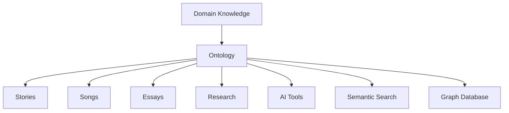
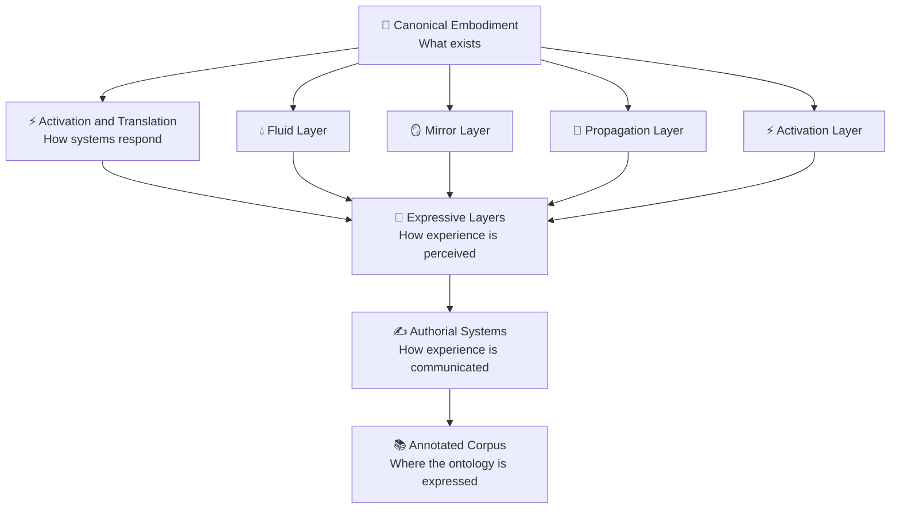
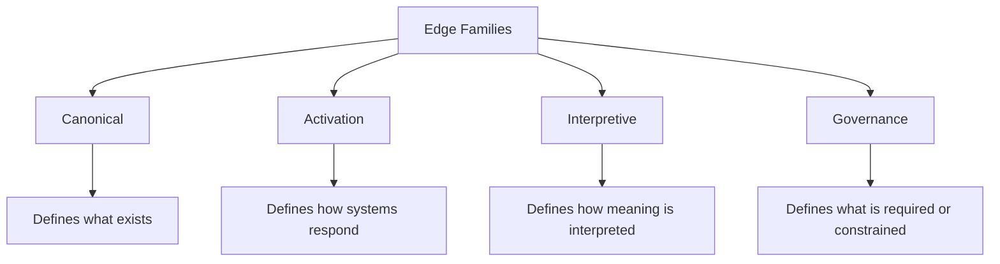
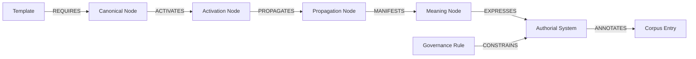
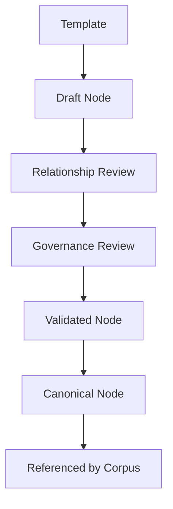
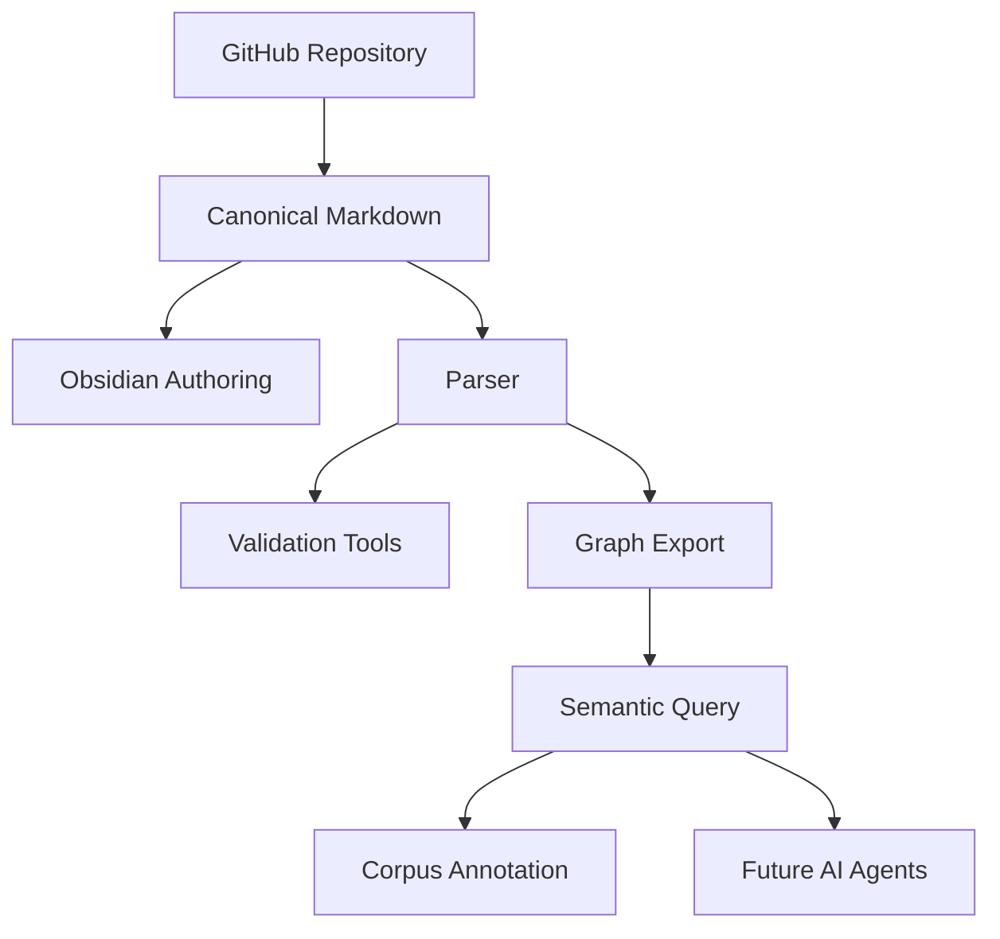

---
tags:
  - Document/README
  - Document/Repository Entry
  - Document/Architecture
  - Project/Somatic Meaning Engine
  - Status/Foundation
  - Phase/Ontology v2
  - Tool/Obsidian
  - Tool/GitHub
aliases:
  - Somatic Meaning Engine
  - K.S. McCrae Ontology
  - Repository README
title: "K.S. McCrae Ontology: Somatic Meaning Engine"
document_type: README
repository_phase: "Ontology v2 Foundation"
status: Foundation
source_of_truth: "GitHub repository"
authoring_environment: "Obsidian Markdown"
last_updated: 2026-06-26
---

# K.S. McCrae Ontology: Somatic Meaning Engine


> From embodiment to meaning through governed knowledge.

---

## 🧭 Overview

The **K.S. McCrae Ontology: Somatic Meaning Engine** is a governed ontology and knowledge architecture for modelling human embodiment, physiological systems, sensory experience, symbolic meaning, and narrative relationships.

It is designed as the canonical knowledge model for the K.S. McCrae writing framework. Creative works, songs, essays, research notes, and future tools become annotated instances of the ontology rather than definitions of it.

> **The ontology defines the knowledge. The works demonstrate its expression.**

| Characteristic | Description |
|---|---|
| 🧬 **Canonical embodiment** | Models anatomy, physiology, fluids, sensory mechanisms, and biological foundations |
| ⚡ **Activation-aware** | Captures activation, propagation, mirror, modulation, and systemic response pathways |
| 🧠 **Meaning-oriented** | Separates objective knowledge from somatic, sensory, symbolic, and authorial interpretation |
| 🛡️ **Governed by design** | Uses templates, edge families, lifecycle status, and revision gates to prevent architectural drift |
| 🕸️ **Graph-ready** | Designed for Obsidian discovery, Dataview queries, future parsers, and graph database export |
| 📚 **Corpus-compatible** | Treats stories, songs, essays, and research as annotated instances rather than canonical definitions |

---

## 👥 Who This Is For

**Primary audience:** K.S. McCrae ontology development, authorial systems design, and AI-assisted knowledge architecture.

**Secondary audience:** Readers, collaborators, and future tools that need to understand how embodiment, activation, meaning, and authored expression are represented in a governed knowledge graph.

> If you care about embodied knowledge, semantic consistency, graph traversal, and the separation of domain knowledge from creative expression, this repository is the source of truth.

---

## 🎯 Purpose

The Somatic Meaning Engine exists to provide a governed, layered knowledge architecture for:

- Human embodiment
- Anatomy and physiology
- Fluids and biological systems
- Sensory experience
- Somatic response
- Activation pathways
- Propagation pathways
- Mirror relationships
- Meaning systems
- Expressive systems
- Authorial systems
- Corpus annotation
- Semantic querying
- Future graph traversal

The ontology prioritises:

- Ontological consistency
- Biological accuracy where applicable
- Somatic realism
- Semantic composability
- Long-term maintainability
- Authorial coherence
- Graph traversal readiness
- Clear separation between knowledge and expression

---

## 🧱 Operating Philosophy

### Model the domain, not the application

The ontology models the domain of embodiment and meaning. Creative applications consume the ontology rather than shaping its foundations.



### Build once. Reference everywhere.

A concept should be defined once and referenced wherever it appears. The same anatomical site, fluid, activation pathway, mirror, meaning system, or authorial constraint should not be redefined across multiple stories or notes.

### Architecture first. Content second.

The ontology is designed before it is populated. Every architectural decision should simplify the creation, validation, and traversal of thousands of future nodes.

> **Slow architecture. Fast content.**

---

## 🏗️ System Architecture

The ontology is organised into four primary layers plus an annotated corpus layer.



---

## 🧬 Epistemic Boundaries

Each layer represents a distinct category of knowledge. Knowledge should remain within its appropriate layer.

| Layer | Defines | Includes |
|---|---|---|
| **Canonical Embodiment** | What exists | Anatomy, physiology, structures, fluids, hormones, objective sensory mechanisms |
| **Activation and Translation** | How systems respond | Activation, propagation, mirrors, relational influence, environmental interaction |
| **Expressive Layers** | How experience is perceived and interpreted | Somatic, sensory, emotional, symbolic, sonic, environmental, liturgical, temporal systems |
| **Authorial Layers** | How experience is communicated | Story Operating Systems, Human Drift Register, Example Register, voice, cadence, stylistic governance |
| **Corpus** | Where the ontology is expressed | Stories, songs, essays, research, annotations, future creative works |


---

## 🗂️ Repository Structure

This repository is authored as an Obsidian-compatible Markdown vault and versioned through GitHub.

- **Obsidian** is the authoring interface.
- **GitHub** is the source of truth.
- Future parsers, validators, graph tools, and AI workflows should consume the Markdown structure rather than replace it.

Obsidian works best with natural language folder names. This repository avoids folder numbering, underscores, and machine-first naming unless technically necessary.

```text
Somatic Meaning Engine/
│
├── 📄 README.md                         ← You are here
│
├── 📁 Archive/                          ← Historical material retained for reference
│
├── 📁 Governance/                       ← Architecture, rules, decisions, and revision gates
│   ├── Architecture.md
│   ├── Node Specification.md
│   ├── Relationship Specification.md
│   ├── Traversal Rules.md
│   ├── Revision Gate.md
│   └── Architectural Decision Records/
│
├── 📁 Templates/                        ← Reusable node and document templates
│
├── 📁 Canonical Embodiment/             ← Objective embodiment nodes
│   ├── Female/
│   ├── Male/
│   ├── Trans Feminine/
│   ├── Trans Masculine/
│   └── Shared/
│
├── 📁 Activation Layer/                 ← Activation logic and response initiation
├── 📁 Propagation Layer/                ← Movement of response through systems
├── 📁 Mirror Layer/                     ← Cross-body and cross-system mirroring
├── 📁 Fluid Layer/                      ← Fluid entities and fluid relationships
├── 📁 Meaning Layer/                    ← Meaning objects and interpretive relationships
│
├── 📁 Expressive Layers/                ← Somatic, sensory, emotional, symbolic, sonic, temporal systems
│
├── 📁 Authorial Systems/                ← Voice, story systems, human drift, and authorial governance
│
├── 📁 Corpus/                           ← Stories, songs, essays, research, and annotated works
│
└── 📁 Scratchpad/                       ← Temporary development material
```

---

## 🔗 Quick Navigation

| Topic | Purpose |
|---|---|
| [Governance](Governance/) | Architecture, rules, revision gates, and decision records |
| [Templates](Templates/) | Reusable structures for future ontology nodes |
| [Canonical Embodiment](Canonical%20Embodiment/) | Objective embodiment knowledge |
| [Activation Layer](Activation%20Layer/) | Activation and response initiation |
| [Propagation Layer](Propagation%20Layer/) | Movement of response across systems |
| [Mirror Layer](Mirror%20Layer/) | Mirroring and sympathetic correspondence |
| [Fluid Layer](Fluid%20Layer/) | Fluid entities and relationships |
| [Meaning Layer](Meaning%20Layer/) | Interpretive meaning objects |
| [Expressive Layers](Expressive%20Layers/) | Somatic, sensory, emotional, symbolic, sonic, environmental, liturgical, and temporal systems |
| [Authorial Systems](Authorial%20Systems/) | Voice, cadence, example register, story operating systems, and authorial governance |
| [Corpus](Corpus/) | Annotated stories, songs, essays, and research |
| [Scratchpad](Scratchpad/) | Temporary working material |

---

## 🧾 Project Instructions

Treat this repository as an ontology engineering and knowledge architecture project.

The primary objective is to construct a coherent, extensible knowledge graph rather than produce creative prose.

Prioritise:

- Entity modelling
- Relationship design
- Graph traversal
- Typed edge definitions
- Semantic consistency
- Reusable abstractions
- Template discipline
- Governance rules
- Long-term extensibility

When reviewing or extending the ontology:

- Preserve the layered architecture.
- Maintain clear separation between biological, activation, expressive, and authorial systems.
- Prefer reusable entities over duplicated information.
- Prefer relationships over repeated prose.
- Identify missing incoming and outgoing relationships.
- Identify orphaned concepts and circular dependencies.
- Recommend abstractions where repeated patterns emerge.
- Consider future graph traversal before adding new concepts.
- Protect biological accuracy where objective knowledge exists.
- Treat stories, songs, essays, and future creative works as annotated instances of the ontology.

---

## 🧠 Controlled Ontology Language

The ontology uses a controlled relationship language.

Every relationship is expressed as:

```text
Subject VERB Object
```

The verb is always a single uppercase relationship term.

Examples:

```text
Vulva HAS Clitoral Complex
Clitoral Complex ACTIVATES Pelvic Floor
Pelvic Floor PROPAGATES Breath
Hormone MODULATES Sensitivity
Story REFERENCES Anatomical Site
Template REQUIRES Embodiment
```

This controlled language supports:

- Human readability
- Obsidian graph filtering
- Dataview querying
- AI interpretation
- Future parser development
- Future JSON export
- Future graph database import
- Future traversal weighting

---

## 🧭 Edge Families

Relationships are organised into four edge families.



### Canonical Edges

Canonical edges define objective or structural relationships.

| Verb | Use | Example Tag |
|---|---|---|
| HAS | Source contains or possesses the target | `Edge/Canonical/HAS` |
| BELONGS | Source belongs to the target category or embodiment | `Edge/Canonical/BELONGS` |
| CONNECTS | Source is structurally or functionally connected to target | `Edge/Canonical/CONNECTS` |
| CONTAINS | Source contains target as an internal element | `Edge/Canonical/CONTAINS` |
| PRODUCES | Source produces target | `Edge/Canonical/PRODUCES` |
| RECEIVES | Source receives input, influence, fluid, or signal from target | `Edge/Canonical/RECEIVES` |

### Activation Edges

Activation edges define response, movement, modulation, and influence.

| Verb | Use | Example Tag |
|---|---|---|
| ACTIVATES | Source initiates response in target | `Edge/Activation/ACTIVATES` |
| PROPAGATES | Source carries or transmits response to target | `Edge/Activation/PROPAGATES` |
| MODULATES | Source alters intensity, timing, or quality of target | `Edge/Activation/MODULATES` |
| TRIGGERS | Source initiates target under specific conditions | `Edge/Activation/TRIGGERS` |
| AMPLIFIES | Source increases target intensity | `Edge/Activation/AMPLIFIES` |
| INHIBITS | Source reduces or suppresses target | `Edge/Activation/INHIBITS` |

### Interpretive Edges

Interpretive edges define meaning, representation, annotation, and expression.

| Verb | Use | Example Tag |
|---|---|---|
| SYMBOLIZES | Source symbolically means or evokes target | `Edge/Interpretive/SYMBOLIZES` |
| REPRESENTS | Source represents target in an expressive or conceptual system | `Edge/Interpretive/REPRESENTS` |
| REFERENCES | Source refers to target | `Edge/Interpretive/REFERENCES` |
| MANIFESTS | Source appears through target | `Edge/Interpretive/MANIFESTS` |
| EXPRESSES | Source communicates target | `Edge/Interpretive/EXPRESSES` |
| REFLECTS | Source reflects target without fully representing it | `Edge/Interpretive/REFLECTS` |
| ANNOTATES | Source annotates target | `Edge/Interpretive/ANNOTATES` |

### Governance Edges

Governance edges define control, validation, constraints, inheritance, and revision logic.

| Verb | Use | Example Tag |
|---|---|---|
| REQUIRES | Source requires target to be valid | `Edge/Governance/REQUIRES` |
| CONSTRAINS | Source limits or governs target | `Edge/Governance/CONSTRAINS` |
| PROTECTS | Source protects target from drift or misuse | `Edge/Governance/PROTECTS` |
| VALIDATES | Source validates target | `Edge/Governance/VALIDATES` |
| PROHIBITS | Source disallows target | `Edge/Governance/PROHIBITS` |
| DEPRECATES | Source marks target as obsolete | `Edge/Governance/DEPRECATES` |
| OVERRIDES | Source supersedes target under defined conditions | `Edge/Governance/OVERRIDES` |
| INHERITS | Source inherits rules or properties from target | `Edge/Governance/INHERITS` |
| PERMITS | Source allows target under defined conditions | `Edge/Governance/PERMITS` |

---

## 🔄 Traversal Model

The ontology is designed for future traversal.

A traversal route may move through canonical, activation, interpretive, and governance edges. Governance edges act as control rails for traversal.



Future traversal may support:

- Edge weights
- Confidence scores
- Embodiment scope
- Source references
- Validation status
- Directionality
- Blocking constraints
- Preferred routes
- Deprecated routes

Example future route query:

```text
Find all paths from Female Embodiment to Sovereignty using Canonical, Activation, and Interpretive edges while obeying all Governance edges.
```

---

## 📋 Node Lifecycle

Every ontology node should answer four questions.

| Question | Defines | Examples |
|---|---|---|
| **What am I?** | Identity | Node type, layer, embodiment scope, canonical name, aliases, purpose |
| **How am I connected?** | Relationships | Incoming edges, outgoing edges, parents, children, inverse relationships |
| **How do I participate?** | Behaviour | Activation, propagation, modulation, mirrors, sensory role, somatic role, meaning role |
| **How am I governed?** | Constraints | Required fields, validation rules, scope limits, inheritance, review requirements |



| Status | Meaning |
|---|---|
| Draft | Initial working version |
| Review | Requires architectural or factual review |
| Validated | Structurally valid within current ontology rules |
| Canonical | Accepted as the current source of truth |
| Deprecated | Retained for history but no longer preferred |
| Replaced | Superseded by another node |

---

## 🧪 Ontology Smell Tests

The following are signs that the architecture may need refinement.

| Smell | Possible Response |
|---|---|
| The same paragraph appears in multiple nodes | Create a shared node or template |
| A property keeps getting longer | Promote it to a first-class node |
| A relationship name needs too many words | Revisit the edge vocabulary |
| A node has excessive outgoing links | Introduce an intermediate abstraction |
| A concept belongs equally to multiple layers | Check for mixed epistemic categories |
| A node cannot explain its purpose | Reconsider whether it should exist |
| A relationship has no direction | Define source and target clearly |
| A corpus example changes the ontology | Move the change into annotation unless it reveals a missing canonical concept |
| A rule exists only in prose | Convert it to governance structure |

---

## 🧾 Architectural Decision Records

Significant architectural choices should be captured as Architectural Decision Records in the Governance folder.

An ADR should record:

- Decision
- Context
- Reason
- Consequences
- Status
- Date

Example:

```text
Decision: Use single uppercase verbs for edge types.
Reason: Supports natural language, Obsidian filtering, AI interpretation, and future graph export.
Status: Accepted.
```

---

## 🗺️ Development Roadmap

| Phase | Focus | Goals |
|---|---|---|
| **Phase 1** | Foundation | Repository architecture, README, governance, node lifecycle, edge families, templates |
| **Phase 2** | Canonical Embodiment | Anatomical site templates, anatomical structure templates, embodiment folders, female validation set |
| **Phase 3** | Activation and Translation | Activation nodes, propagation nodes, mirror nodes, fluid nodes, modulation rules |
| **Phase 4** | Expressive Systems | Somatic, sensory, emotional, symbolic, sonic, temporal, environmental, and liturgical systems |
| **Phase 5** | Authorial Systems | Story Operating Systems, Human Drift Register, Example Register, voice and cadence governance |
| **Phase 6** | Corpus Annotation | Existing stories, songs, lyrics, essays, research, recurring routes |
| **Phase 7** | Tooling | Markdown parser, edge extraction, backlink reports, orphan detection, JSON and graph export |

---

## 🔮 Long-Term Platform Vision

The Somatic Meaning Engine is intended to evolve from Markdown knowledge base into a graph-backed meaning platform.



Future capabilities may include:

- Semantic querying
- Ontology traversal
- Graph visualisation
- Validation reports
- Edge weighting
- Route analysis
- Corpus mapping
- Story comparison
- Song motif analysis
- AI-assisted ontology review
- AI-assisted annotation
- Neo4j or graph database export

---

## 🧷 Repository Principles

### Every Markdown file represents a knowledge object

Files are not merely notes. Each file should represent a node, rule, template, annotation, or architectural decision.

### Every new concept must earn its place

A concept should only become a node when it has sufficient identity, relationships, and purpose.

### The ontology should remain modular

Large monolithic entries should be avoided where smaller linked entities would improve traversal and reuse.

### Corpus does not define canon

Stories, songs, essays, and research notes may reveal gaps in the ontology, but they do not directly define canonical knowledge.

### Governance protects the graph

Governance rules exist to prevent drift, duplication, and uncontrolled expansion.

---

## 📖 Glossary

| Term | Definition |
|---|---|
| **Ontology** | A structured model of entities, relationships, rules, and categories within a domain |
| **Node** | A discrete knowledge object represented by a Markdown file |
| **Edge** | A typed relationship between two nodes |
| **Edge Family** | A category of relationship types, such as Canonical, Activation, Interpretive, or Governance |
| **Canonical Embodiment** | The layer defining objective embodiment knowledge, including anatomy, physiology, fluids, and biological systems |
| **Activation** | The initiation of response within or between systems |
| **Propagation** | The movement of response, signal, sensation, influence, or meaning from one node or system to another |
| **Mirror** | A cross-body, cross-system, relational, or symbolic correspondence where one node reflects, echoes, or responds to another |
| **Expressive Layer** | A layer that describes how embodied knowledge becomes perceived, felt, interpreted, or symbolically meaningful |
| **Authorial System** | A governed system that controls how ontology-derived meaning is communicated in the K.S. McCrae framework |
| **Corpus** | The body of stories, songs, essays, research, and creative works annotated against the ontology |
| **Governance** | The rule system that defines requirements, constraints, validation, inheritance, deprecation, and architectural protection |

---

## 🚦 Current Starting Point

This repository has been reset into a clean ontology-first structure.

Earlier material has been retained in the Archive folder for historical reference.

Current development priority:

```text
README
↓
Governance
↓
Templates
↓
Canonical Embodiment
↓
Activation and Translation
↓
Expressive Systems
↓
Authorial Systems
↓
Corpus Annotation
↓
Tooling
```

---

## Closing Principle

The Somatic Meaning Engine is built on one governing distinction:

> **The ontology defines the knowledge. The works demonstrate its expression.**
