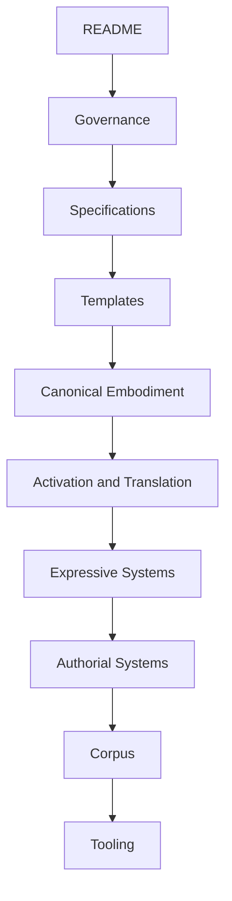

---
tags:
  - Document/README
  - Document/Repository Entry
  - Document/Architecture
  - Project/Somatic Meaning Engine
  - Status/Baseline
  - Phase/Ontology v2
  - Tool/Obsidian
  - Tool/GitHub
aliases:
  - Somatic Meaning Engine
  - K.S. McCrae Ontology
  - Repository README
title: "K.S. McCrae Ontology: Somatic Meaning Engine"
file_class: Document
document_type: README
repository_phase: "Ontology v2 Foundation"
status: Baseline
source_of_truth: "GitHub repository"
authoring_environment: "Obsidian Markdown"
last_updated: 2026-06-29
---

# K.S. McCrae Ontology: Somatic Meaning Engine


**From embodiment to meaning through governed knowledge.**

The **K.S. McCrae Ontology: Somatic Meaning Engine** is a governed ontology and knowledge architecture for modelling human embodiment, physiological systems, sensory experience, symbolic meaning, and narrative relationships.

It is designed as the canonical knowledge model for the K.S. McCrae writing framework. Creative works, songs, essays, research notes, and future tools become annotated instances of the ontology rather than definitions of it.

> **The ontology defines the knowledge. The works demonstrate its expression.**

---

## Current Status

| Field | Value |
|---|---|
| Architecture | Baseline v2.0 |
| Primary Function | Governed knowledge architecture |
| Authoring Environment | Obsidian Markdown |
| Source of Truth | GitHub repository |
| Current Mode | Construction |
| Priority | Architecture locked, content creation next |

---

## Architecture Baseline

The repository is now operating from the **Architecture Baseline v2.0**.

Future architecture changes should be handled through an architectural decision record in [Governance/Decisions](Governance/Decisions/Decision%20Records%20Framework.md).

Core decisions now considered stable:

- Repository folder structure
- File class model
- Layer model
- Edge families
- Controlled relationship language
- Metadata conventions
- Architecture-first workflow

---

## Repository Map

### Governance

| Area | Link | Purpose |
|---|---|---|
| Governance | [Governance](Governance/Governance%20Framework.md) | Architecture, specifications, standards, and decisions |
| Architecture | [Governance/Architecture](Governance/Architecture/Architecture%20Framework.md) | Architecture-level documents |
| Specifications | [Governance/Specifications](Governance/Specifications/Specification%20Framework.md) | Implementation specifications |
| Standards | [Governance/Standards](Governance/Standards/Standards%20Framework.md) | Naming and repository standards |
| Decisions | [Governance/Decisions](Governance/Decisions/Decision%20Records%20Framework.md) | Architectural decision records |

### Core Specifications

| Specification | Link |
|---|---|
| Architecture | [Architecture](Governance/Architecture/Architecture.md) |
| Repository Meta Ontology | [Repository Meta Ontology](Governance/Specifications/Repository%20Meta%20Ontology.md) |
| Document Specification | [Document Specification](Governance/Specifications/Document%20Specification.md) |
| Node Specification | [Node Specification](Governance/Specifications/Node%20Specification.md) |
| Relationship Specification | [Relationship Specification](Governance/Specifications/Relationship%20Specification.md) |
| Template Specification | [Template Specification](Governance/Specifications/Template%20Specification.md) |
| Traversal Specification | [Traversal Specification](Governance/Specifications/Traversal%20Specification.md) |
| Validation Philosophy | [Validation Philosophy](Governance/Specifications/Validation%20Philosophy.md) |

### Standards

| Standard | Link |
|---|---|
| Naming Standard | [Naming Standard](Governance/Standards/Naming%20Standard.md) |
| Metadata Standard | [Metadata Standard](Governance/Standards/Metadata%20Standard.md) |
| YAML Standard | [YAML Standard](Governance/Standards/YAML%20Standard.md) |
| Markdown Standard | [Markdown Standard](Governance/Standards/Markdown%20Standard.md) |
| Repository Lifecycle Standard | [Repository Lifecycle Standard](Governance/Standards/Repository%20Lifecycle%20Standard.md) |

### Architectural Decisions

| ADR | Link |
|---|---|
| ADR 001 Repository Foundation | [ADR 001](Governance/Decisions/ADR%20001%20Repository%20Foundation.md) |
| ADR 002 Architecture Baseline v2 | [ADR 002](Governance/Decisions/ADR%20002%20Architecture%20Baseline%20v2.md) |

---

## Ontology Structure

| Folder | Link | Function |
|---|---|---|
| Canonical Embodiment | [Canonical Embodiment](Canonical%20Embodiment/Index.md) | Defines objective embodiment knowledge |
| Activation Layer | [Activation Layer](Activation%20Layer/Activation%20Layer%20Framework.md) | Defines response initiation |
| Propagation Layer | [Propagation Layer](Propagation%20Layer/Propagation%20Layer%20Framework.md) | Defines movement across systems |
| Mirror Layer | [Mirror Layer](Mirror%20Layer/README.md) | Defines mirror relationships |
| Fluid Layer | [Fluid Layer](Fluid%20Layer/README.md) | Defines fluid entities and relationships |
| Meaning Layer | [Meaning Layer](Meaning%20Layer/Meaning%20Layer%20Framework.md) | Defines meaning objects |
| Expressive Layers | [Expressive Layers](Expressive%20Layers/README.md) | Defines expressive systems |
| Authorial Systems | [Authorial Systems](Authorial%20Systems/Authorial%20Systems%20Framework.md) | Defines authorial systems |
| Corpus | [Corpus](Corpus/Corpus%20Framework.md) | Contains annotated works |
| Templates | [Templates](Templates/Templates%20Framework.md) | Contains reusable structures |
| Scratchpad | [Scratchpad](Scratchpad/Index.md) | Holds temporary work |

### Canonical Embodiment

| Folder | Link |
|---|---|
| Female | [Female](Canonical%20Embodiment/Female/Female%20Embodiment%20Framework.md) |
| Male | [Male](Canonical%20Embodiment/Male/Male%20Embodiment%20Framework.md) |
| Trans Feminine | [Trans Feminine](Canonical%20Embodiment/Trans%20Feminine/Trans%20Feminine%20Embodiment%20Framework.md) |
| Trans Masculine | [Trans Masculine](Canonical%20Embodiment/Trans%20Masculine/Trans%20Masculine%20Embodiment%20Framework.md) |

### Expressive Layers

| Folder | Link |
|---|---|
| Somatic | [Somatic](Expressive%20Layers/Somatic/README.md) |
| Sensory | [Sensory](Expressive%20Layers/Sensory/Sensory%20Index.md) |
| Emotional | [Emotional](Expressive%20Layers/Emotional/README.md) |
| Symbolic | [Symbolic](Expressive%20Layers/Symbolic/Symbolic%20Index.md) |
| Sonic | [Sonic](Expressive%20Layers/Sonic/README.md) |
| Environmental | [Environmental](Expressive%20Layers/Environmental/README.md) |
| Liturgical | [Liturgical](Expressive%20Layers/Liturgical/README.md) |
| Temporal | [Temporal](Expressive%20Layers/Temporal/Temporal%20Index.md) |

### Authorial Systems

| Folder | Link |
|---|---|
| Story Operating Systems | [Story Operating Systems](Authorial%20Systems/Story%20Operating%20Systems/Story%20Operating%20Systems%20Index.md) |
| Example Register | [Example Register](Authorial%20Systems/Example%20Register/Example%20Register%20Index.md) |
| Human Drift Register | [Human Drift Register](Authorial%20Systems/Human%20Drift%20Register/Human%20Drift%20Register%20Index.md) |

### Corpus

| Folder | Link |
|---|---|
| Stories | [Stories](Corpus/Stories/Stories%20Index.md) |
| Songs | [Songs](Corpus/Songs/README.md) |
| Essays | [Essays](Corpus/Essays/Essays%20Index.md) |
| Research | [Research](Corpus/Research/Research%20Index.md) |

### Templates

| Folder | Link |
|---|---|
| Canonical | [Canonical](Templates/Canonical/Canonical%20Templates%20Index.md) |
| Translation | [Translation](Templates/Translation/Translation%20Templates%20Index.md) |
| Expressive | [Expressive](Templates/Expressive/README.md) |
| Authorial | [Authorial](Templates/Authorial/Authorial%20Templates%20Index.md) |
| Annotation | [Annotation](Templates/Annotation/README.md) |

---

## File Class Model

Every Markdown file belongs to the repository, but not every Markdown file performs the same function.

The repository uses `file_class` to distinguish file function.

| File Class | Function |
|---|---|
| Document | Explains, governs, specifies, or guides |
| Ontology Node | Defines a domain knowledge object |
| Template | Defines reusable structure |
| Corpus Annotation | Annotates a creative or research work |
| ADR | Records an architectural decision |
| Scratchpad | Holds temporary work |

Subtypes are defined by class-specific fields such as:

- `document_type`
- `node_type`
- `template_type`
- `corpus_type`

This separation prevents ontology nodes from being treated as ordinary documents while still allowing every file to remain discoverable in Obsidian.

---

## Controlled Ontology Language

Relationships use a controlled natural language pattern:

```text
Subject VERB Object
```

The verb is uppercase, compact, and reusable.

Relationship tags use this pattern:

```text
Edge/Family/VERB
```

Edge families:

| Family | Function |
|---|---|
| Canonical | Defines structural knowledge |
| Activation | Defines response and interaction |
| Interpretive | Defines meaning and representation |
| Governance | Defines requirements and constraints |

---

## Development Flow



---

## Construction Mode

The repository has now moved from architecture design into construction mode.

From this point forward, the default question is no longer:

> How should this be structured?

The default question becomes:

> Which existing structure does this instantiate?

Future work should focus on:

- Creating templates
- Creating canonical nodes
- Building embodiment layers
- Adding activation and translation structures
- Adding expressive systems
- Annotating corpus entries
- Building validation and traversal tooling

---

## Closing Principle

The Somatic Meaning Engine is built on one governing distinction:

> **The ontology defines the knowledge. The works demonstrate its expression.**
