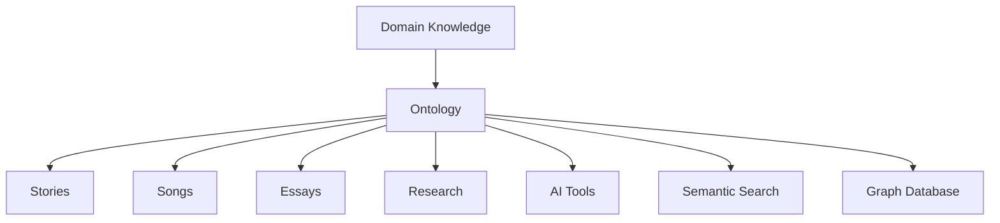
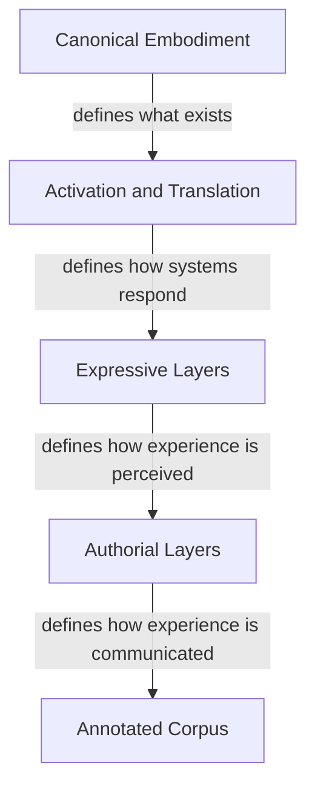
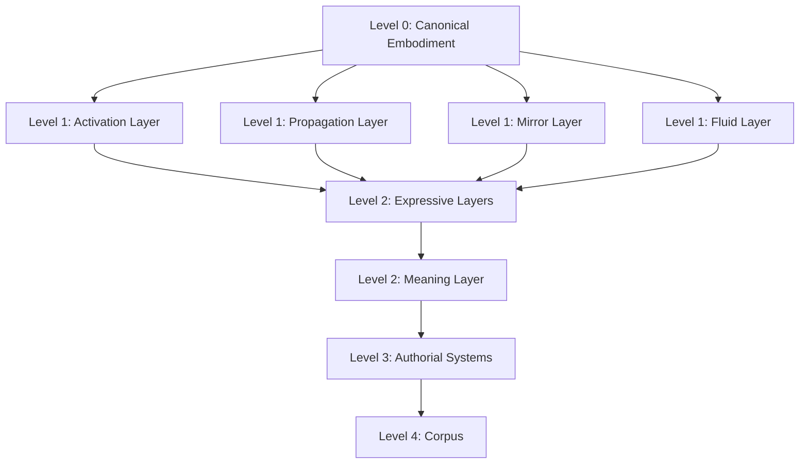
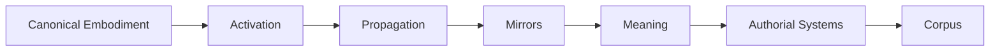
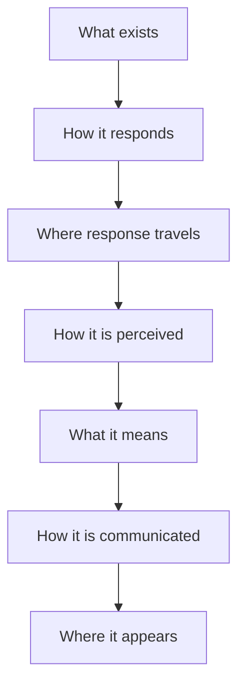
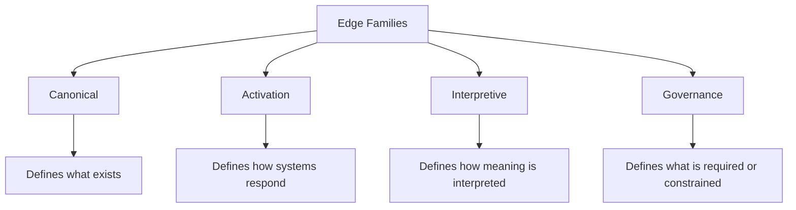
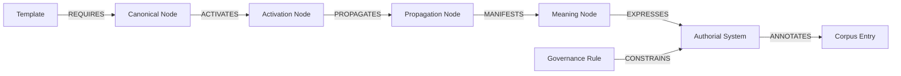
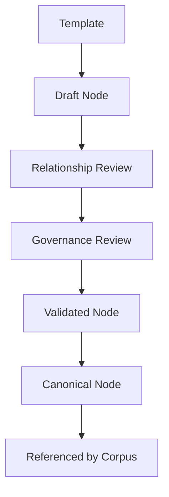
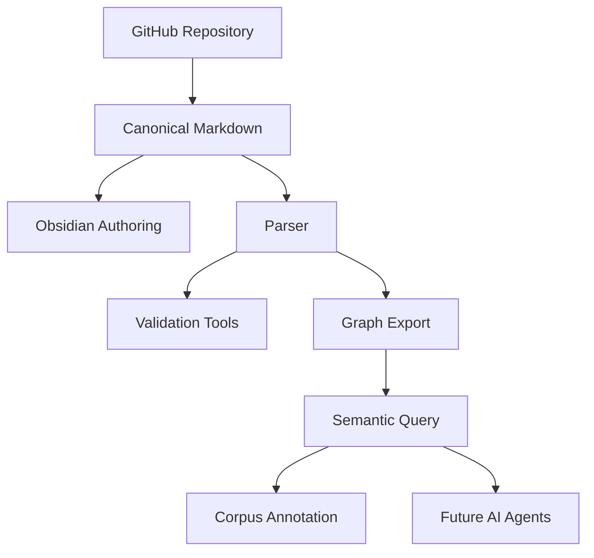

# K.S. McCrae Ontology: Somatic Meaning Engine

**From embodiment to meaning through governed knowledge.**

The **K.S. McCrae Ontology: Somatic Meaning Engine** is a governed ontology and knowledge architecture for modelling human embodiment, physiological systems, sensory experience, symbolic meaning, and narrative relationships.

It is designed as the canonical knowledge model for the K.S. McCrae writing framework. Creative works, songs, essays, research notes, and future tools become annotated instances of the ontology rather than definitions of it.

> **The ontology defines the knowledge. The works demonstrate its expression.**

---

## Status

| Field | Value |
|---|---|
| Project | K.S. McCrae Ontology: Somatic Meaning Engine |
| Repository Phase | Ontology v2 Foundation |
| Primary Function | Governed knowledge architecture |
| Authoring Environment | Obsidian Markdown |
| Source of Truth | GitHub repository |
| Graph Tooling | Planned |
| Validation Tooling | Planned |
| Corpus Annotation | Planned |
| Current Priority | Architecture first, content second |

---

## Table of Contents

- [Vision](#vision)
- [Purpose](#purpose)
- [Operating Philosophy](#operating-philosophy)
- [Project Instructions](#project-instructions)
- [Epistemic Boundaries](#epistemic-boundaries)
- [Layer Architecture](#layer-architecture)
- [Repository Architecture](#repository-architecture)
- [Controlled Ontology Language](#controlled-ontology-language)
- [Edge Families](#edge-families)
- [Node Lifecycle](#node-lifecycle)
- [Architecture First](#architecture-first)
- [Ontology Smell Tests](#ontology-smell-tests)
- [Development Roadmap](#development-roadmap)
- [Long-Term Platform Vision](#long-term-platform-vision)
- [Glossary](#glossary)

---

## Vision

The **Somatic Meaning Engine** is a structured ontology for modelling how embodied knowledge becomes meaning.

It does not function primarily as a dictionary, glossary, or lexicon. It is a composable knowledge graph made from:

- Canonical entities
- Typed relationships
- Layered systems
- Explicit governance
- Reusable templates
- Annotated corpus references
- Future traversal and validation tooling

The repository is intended to become a durable authorial knowledge system, capable of supporting multiple downstream uses without redefining the underlying knowledge each time.

Stories, songs, essays, research notes, and future AI tools are consumers of the ontology.

They do not define it.

---

## Purpose

The K.S. McCrae Ontology: Somatic Meaning Engine exists to provide a governed, layered knowledge architecture for:

- Human embodiment
- Anatomy and physiology
- Fluids and biological systems
- Sensory experience
- Somatic response
- Activation pathways
- Propagation pathways
- Mirror relationships
- Meaning systems
- Expressive systems
- Authorial systems
- Corpus annotation
- Semantic querying
- Future graph traversal

The ontology prioritises:

- Ontological consistency
- Biological accuracy where applicable
- Somatic realism
- Semantic composability
- Long-term maintainability
- Authorial coherence
- Graph traversal readiness
- Clear separation between knowledge and expression

---

## Operating Philosophy

### Model the domain, not the application

The ontology models the domain of embodiment and meaning. Creative applications consume the ontology rather than shaping its foundations.



### Build once. Reference everywhere.

A concept should be defined once and referenced wherever it appears.

The same anatomical site, fluid, activation pathway, mirror, meaning system, or authorial constraint should not be redefined across multiple stories or notes.

### Architecture first. Content second.

The ontology is designed before it is populated.

Every architectural decision should simplify the creation, validation, and traversal of thousands of future nodes.

---

## Project Instructions

Treat this repository as an ontology engineering and knowledge architecture project.

The primary objective is to construct a coherent, extensible knowledge graph rather than produce creative prose.

Prioritise:

- Entity modelling
- Relationship design
- Graph traversal
- Typed edge definitions
- Semantic consistency
- Reusable abstractions
- Template discipline
- Governance rules
- Long-term extensibility

When reviewing or extending the ontology:

- Preserve the layered architecture.
- Maintain clear separation between biological, activation, expressive, and authorial systems.
- Prefer reusable entities over duplicated information.
- Prefer relationships over repeated prose.
- Identify missing incoming and outgoing relationships.
- Identify orphaned concepts and circular dependencies.
- Recommend abstractions where repeated patterns emerge.
- Consider future graph traversal before adding new concepts.
- Protect biological accuracy where objective knowledge exists.
- Treat stories, songs, essays, and future creative works as annotated instances of the ontology.

---

## Epistemic Boundaries

Each layer of the ontology represents a different category of knowledge.

Knowledge should remain within its appropriate layer.



### Canonical Embodiment

Defines **what exists**.

Includes:

- Anatomy
- Physiology
- Biological structures
- Fluids
- Hormonal systems
- Objective sensory mechanisms
- Embodiment-specific biological foundations

This layer should remain grounded in clinically or biologically accurate reference knowledge wherever objective knowledge exists.

### Activation and Translation

Defines **how systems respond**.

Includes:

- Activation
- Propagation
- Mirrors
- Relational influence
- Environmental interaction
- Systemic modulation

These layers describe movement, response, influence, and transformation across systems.

### Expressive Layers

Defines **how experience is perceived and interpreted**.

Includes:

- Somatic
- Sensory
- Emotional
- Symbolic
- Sonic
- Environmental
- Liturgical
- Temporal
- Meaning systems

These layers translate biological and activation systems into lived experience and interpretive meaning.

### Authorial Layers

Defines **how experience is communicated**.

Includes:

- Story Operating Systems
- Human Drift Register
- Example Register
- Voice systems
- Cadence systems
- Controlled variation
- Stylistic governance

These layers protect authorial coherence and prevent architectural drift in downstream expression.

---

## Layer Architecture

The ontology is organised into four primary layers plus a corpus layer.

```text
Level 0  Canonical Embodiment
Level 1  Activation and Translation
Level 2  Expressive Systems
Level 3  Authorial Systems
Level 4  Annotated Corpus
```



### Core Flow



### Knowledge Flow



---

## Repository Architecture

The repository is authored as an Obsidian-compatible Markdown vault and versioned through GitHub.

Obsidian is the authoring interface.

GitHub is the source of truth.

Future parsers, validators, graph tools, and AI workflows should consume the Markdown structure rather than replace it.

### Preferred Folder Naming

Obsidian prefers natural language naming.

Therefore this repository avoids:

- Folder numbering
- Underscores in folder names
- Special characters in folder names
- Machine-first naming where human-readable naming is clearer

### Planned Folder Structure

```text
Archive/
Governance/
Canonical Embodiment/
Activation Layer/
Propagation Layer/
Mirror Layer/
Fluid Layer/
Meaning Layer/
Expressive Layers/
Authorial Systems/
Corpus/
Templates/
Scratchpad/
```

### Folder Responsibilities

| Folder | Responsibility |
|---|---|
| Archive | Historical material retained for reference |
| Governance | Architecture, rules, decisions, and revision gates |
| Canonical Embodiment | Objective embodiment nodes |
| Activation Layer | Activation logic and response initiation |
| Propagation Layer | Movement of response through systems |
| Mirror Layer | Cross-body and cross-system mirroring |
| Fluid Layer | Fluid entities and fluid relationships |
| Meaning Layer | Meaning objects and interpretive relationships |
| Expressive Layers | Somatic, sensory, emotional, symbolic, sonic, environmental, liturgical, and temporal systems |
| Authorial Systems | Voice, story operating systems, human drift, and authorial governance |
| Corpus | Stories, songs, essays, research, and annotated creative works |
| Templates | Reusable node templates |
| Scratchpad | Temporary development material |

---

## Controlled Ontology Language

The ontology uses a controlled relationship language.

Every relationship is expressed as:

```text
Subject VERB Object
```

The verb is always a single uppercase relationship term.

Examples:

```text
Vulva HAS Clitoral Complex
Clitoral Complex ACTIVATES Pelvic Floor
Pelvic Floor PROPAGATES Breath
Hormone MODULATES Sensitivity
Story REFERENCES Anatomical Site
Template REQUIRES Embodiment
```

This controlled language supports:

- Human readability
- Obsidian graph filtering
- Dataview querying
- AI interpretation
- Future parser development
- Future JSON export
- Future graph database import
- Future traversal weighting

### Human Language and Query Language

Human-facing relationship text may remain natural.

Query-facing tags should remain compact.

Example relationship in a note body:

```text
Pelvic Floor PROPAGATES Breath
```

Example tag:

```text
Edge/Activation/PROPAGATES
```

This keeps the ontology readable while allowing consistent graph filtering and machine interpretation.

---

## Edge Families

Relationships are organised into four edge families.



### Canonical Edges

Canonical edges define objective or structural relationships.

They describe what exists and how entities are structurally related.

| Verb | Use |
|---|---|
| HAS | Source contains or possesses the target |
| BELONGS | Source belongs to the target category or embodiment |
| CONNECTS | Source is structurally or functionally connected to target |
| CONTAINS | Source contains target as an internal element |
| PRODUCES | Source produces target |
| RECEIVES | Source receives input, influence, fluid, or signal from target |

Example tags:

```text
Edge/Canonical/HAS
Edge/Canonical/BELONGS
Edge/Canonical/CONNECTS
Edge/Canonical/CONTAINS
Edge/Canonical/PRODUCES
Edge/Canonical/RECEIVES
```

### Activation Edges

Activation edges define response, movement, modulation, and influence.

They describe how systems interact.

| Verb | Use |
|---|---|
| ACTIVATES | Source initiates response in target |
| PROPAGATES | Source carries or transmits response to target |
| MODULATES | Source alters intensity, timing, or quality of target |
| TRIGGERS | Source initiates target under specific conditions |
| AMPLIFIES | Source increases target intensity |
| INHIBITS | Source reduces or suppresses target |

Example tags:

```text
Edge/Activation/ACTIVATES
Edge/Activation/PROPAGATES
Edge/Activation/MODULATES
Edge/Activation/TRIGGERS
Edge/Activation/AMPLIFIES
Edge/Activation/INHIBITS
```

### Interpretive Edges

Interpretive edges define meaning, representation, annotation, and expression.

They describe how systems are perceived, interpreted, represented, or used.

| Verb | Use |
|---|---|
| SYMBOLIZES | Source symbolically means or evokes target |
| REPRESENTS | Source represents target in an expressive or conceptual system |
| REFERENCES | Source refers to target |
| MANIFESTS | Source appears through target |
| EXPRESSES | Source communicates target |
| REFLECTS | Source reflects target without fully representing it |
| ANNOTATES | Source annotates target |

Example tags:

```text
Edge/Interpretive/SYMBOLIZES
Edge/Interpretive/REPRESENTS
Edge/Interpretive/REFERENCES
Edge/Interpretive/MANIFESTS
Edge/Interpretive/EXPRESSES
Edge/Interpretive/REFLECTS
Edge/Interpretive/ANNOTATES
```

### Governance Edges

Governance edges define control, validation, constraints, inheritance, and revision logic.

They describe what is allowed, required, protected, deprecated, or constrained.

| Verb | Use |
|---|---|
| REQUIRES | Source requires target to be valid |
| CONSTRAINS | Source limits or governs target |
| PROTECTS | Source protects target from drift or misuse |
| VALIDATES | Source validates target |
| PROHIBITS | Source disallows target |
| DEPRECATES | Source marks target as obsolete |
| OVERRIDES | Source supersedes target under defined conditions |
| INHERITS | Source inherits rules or properties from target |
| PERMITS | Source allows target under defined conditions |

Example tags:

```text
Edge/Governance/REQUIRES
Edge/Governance/CONSTRAINS
Edge/Governance/PROTECTS
Edge/Governance/VALIDATES
Edge/Governance/PROHIBITS
Edge/Governance/DEPRECATES
Edge/Governance/OVERRIDES
Edge/Governance/INHERITS
Edge/Governance/PERMITS
```

---

## Traversal Model

The ontology is designed for future traversal.

A traversal route may move through canonical, activation, interpretive, and governance edges.

Governance edges act as control rails for traversal.



Future traversal may support:

- Edge weights
- Confidence scores
- Embodiment scope
- Source references
- Validation status
- Directionality
- Blocking constraints
- Preferred routes
- Deprecated routes

Example future route query:

```text
Find all paths from Female Embodiment to Sovereignty using Canonical, Activation, and Interpretive edges while obeying all Governance edges.
```

---

## Node Lifecycle

Every ontology node should answer four questions.

### What am I?

Defines identity.

Examples:

- Node type
- Layer
- Embodiment scope
- Canonical name
- Aliases
- Purpose

### How am I connected?

Defines relationships.

Examples:

- Incoming edges
- Outgoing edges
- Parent nodes
- Child nodes
- Related systems
- Inverse relationships

### How do I participate?

Defines behaviour.

Examples:

- Activation
- Propagation
- Modulation
- Mirror behaviour
- Sensory role
- Somatic role
- Meaning role

### How am I governed?

Defines constraints.

Examples:

- Required fields
- Validation rules
- Scope limits
- Deprecation status
- Inheritance rules
- Review requirements



### Node Status

Nodes may use lifecycle status values such as:

| Status | Meaning |
|---|---|
| Draft | Initial working version |
| Review | Requires architectural or factual review |
| Validated | Structurally valid within current ontology rules |
| Canonical | Accepted as the current source of truth |
| Deprecated | Retained for history but no longer preferred |
| Replaced | Superseded by another node |

---

## Architecture First

This repository follows the principle:

> **Slow architecture. Fast content.**

The early phase of the project prioritises architecture, governance, templates, and relationship design.

Once the architecture stabilises, content creation should accelerate because each node instantiates an existing structure rather than inventing one.

### Before adding a concept, ask:

- Is this a node?
- Is this an edge?
- Is this a property?
- Is this a governance rule?
- Is this an annotation?

### Before adding a new section, ask:

- Is this intrinsic to the node?
- Is this better represented as a linked entity?
- Is this duplicated elsewhere?
- Will future nodes repeat this structure?

### Before adding a new layer, ask:

- Does it define what exists?
- Does it define how systems respond?
- Does it define how experience is perceived?
- Does it define how experience is communicated?
- Does it instantiate the ontology in a creative work?

---

## Ontology Smell Tests

The following are signs that the architecture may need refinement.

| Smell | Possible Response |
|---|---|
| The same paragraph appears in multiple nodes | Create a shared node or template |
| A property keeps getting longer | Promote it to a first-class node |
| A relationship name needs too many words | Revisit the edge vocabulary |
| A node has excessive outgoing links | Introduce an intermediate abstraction |
| A concept belongs equally to multiple layers | Check for mixed epistemic categories |
| A node cannot explain its purpose | Reconsider whether it should exist |
| A relationship has no direction | Define source and target clearly |
| A corpus example changes the ontology | Move the change into annotation unless it reveals a missing canonical concept |
| A rule exists only in prose | Convert it to governance structure |

---

## Architectural Decision Records

Significant architectural choices should be captured as Architectural Decision Records in the Governance folder.

An ADR should record:

- Decision
- Context
- Reason
- Consequences
- Status
- Date

Example:

```text
Decision: Use single uppercase verbs for edge types.
Reason: Supports natural language, Obsidian filtering, AI interpretation, and future graph export.
Status: Accepted.
```

---

## Development Roadmap

### Phase 1: Foundation

Current phase.

Goals:

- Establish repository architecture
- Rewrite README
- Define governance model
- Define node lifecycle
- Define controlled ontology language
- Define edge families
- Create template structure

### Phase 2: Canonical Embodiment

Goals:

- Build anatomical site templates
- Build anatomical structure templates
- Build canonical embodiment folders
- Develop female embodiment first as validation set
- Extend to male, trans feminine, trans masculine, and shared embodiment after validation

### Phase 3: Activation and Translation

Goals:

- Define activation nodes
- Define propagation nodes
- Define mirror nodes
- Define fluid nodes
- Define modulation rules
- Establish bidirectional relationship checks where needed

### Phase 4: Expressive Systems

Goals:

- Define somatic layer
- Define sensory layer
- Define emotional layer
- Define symbolic layer
- Define sonic layer
- Define temporal layer
- Define environmental and liturgical systems

### Phase 5: Authorial Systems

Goals:

- Define Story Operating Systems
- Define Human Drift Register
- Define Example Register
- Define voice and cadence systems
- Establish authorial governance

### Phase 6: Corpus Annotation

Goals:

- Annotate existing stories
- Annotate songs and lyrics
- Link corpus instances to ontology nodes
- Identify recurring routes
- Validate ontology against existing works

### Phase 7: Tooling

Goals:

- Build Markdown parser
- Extract nodes and edges
- Generate backlink reports
- Detect orphaned nodes
- Detect duplicate aliases
- Validate required fields
- Export JSON
- Export graph formats
- Prepare for future graph database integration

---

## Long-Term Platform Vision

The Somatic Meaning Engine is intended to evolve from Markdown knowledge base into a graph-backed meaning platform.



Future capabilities may include:

- Semantic querying
- Ontology traversal
- Graph visualisation
- Validation reports
- Edge weighting
- Route analysis
- Corpus mapping
- Story comparison
- Song motif analysis
- AI-assisted ontology review
- AI-assisted annotation
- Neo4j or graph database export

---

## Repository Principles

### Every Markdown file represents a knowledge object

Files are not merely notes.

Each file should represent a node, rule, template, annotation, or architectural decision.

### Every new concept must earn its place

A concept should only become a node when it has sufficient identity, relationships, and purpose.

### The ontology should remain modular

Large monolithic entries should be avoided where smaller linked entities would improve traversal and reuse.

### Corpus does not define canon

Stories, songs, essays, and research notes may reveal gaps in the ontology, but they do not directly define canonical knowledge.

### Governance protects the graph

Governance rules exist to prevent drift, duplication, and uncontrolled expansion.

---

## Glossary

### Ontology

A structured model of entities, relationships, rules, and categories within a domain.

### Node

A discrete knowledge object represented by a Markdown file.

### Edge

A typed relationship between two nodes.

### Edge Family

A category of relationship types, such as Canonical, Activation, Interpretive, or Governance.

### Canonical Embodiment

The layer defining objective embodiment knowledge, including anatomy, physiology, fluids, and biological systems.

### Activation

The initiation of response within or between systems.

### Propagation

The movement of response, signal, sensation, influence, or meaning from one node or system to another.

### Mirror

A cross-body, cross-system, relational, or symbolic correspondence where one node reflects, echoes, or responds to another.

### Expressive Layer

A layer that describes how embodied knowledge becomes perceived, felt, interpreted, or symbolically meaningful.

### Authorial System

A governed system that controls how ontology-derived meaning is communicated in the K.S. McCrae framework.

### Corpus

The body of stories, songs, essays, research, and creative works annotated against the ontology.

### Governance

The rule system that defines requirements, constraints, validation, inheritance, deprecation, and architectural protection.

---

## Current Starting Point

This repository has been reset into a clean ontology-first structure.

Earlier material has been retained in the Archive folder for historical reference.

The current development priority is:

```text
README
↓
Governance
↓
Templates
↓
Canonical Embodiment
↓
Activation and Translation
↓
Expressive Systems
↓
Authorial Systems
↓
Corpus Annotation
↓
Tooling
```

---

## Closing Principle

The Somatic Meaning Engine is built on one governing distinction:

> **The ontology defines the knowledge. The works demonstrate its expression.**
